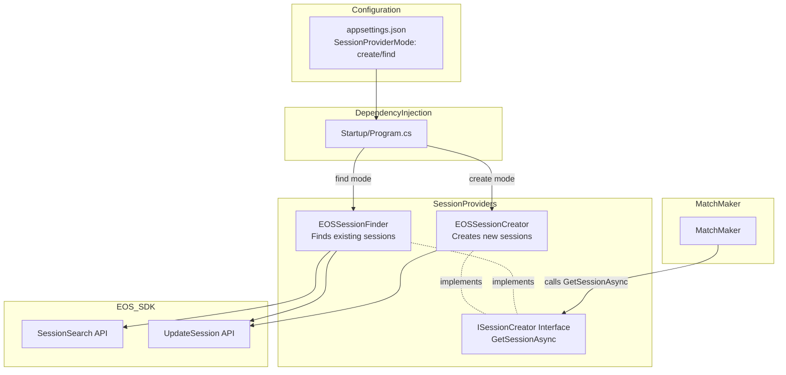
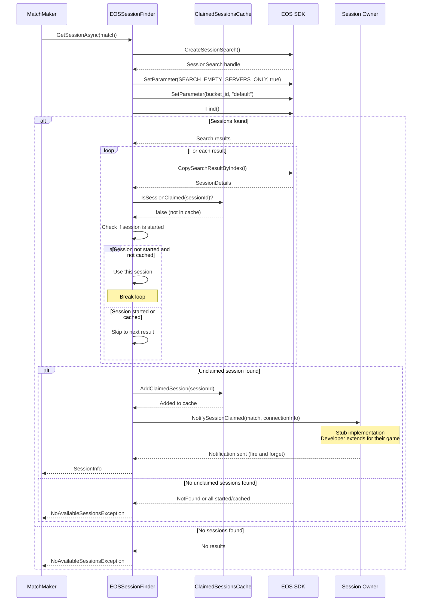

# Design Document: Session Finder for Existing Sessions

## Overview

This design adds an alternative implementation of the `ISessionCreator` interface that finds and claims existing available EOS sessions instead of creating new ones. This supports architectural patterns where game servers or hosts pre-create sessions and the matchmaker assigns player groups to available sessions.

The system provides two session provider implementations:
- **EOSSessionCreator** (existing): Creates new sessions - suitable for P2P gameplay or when integrating with a dedicated server provider
- **EOSSessionFinder** (new): Finds existing sessions - suitable for player-hosted servers or dedicated servers that create their own sessions

Both implementations use the same interface, allowing operators to switch between patterns via configuration without code changes.

## Architecture

### Component Diagram



### Session Finding Flow



## Components and Interfaces

### ISessionCreator Interface (Renamed Method)

```csharp
/// <summary>
/// Interface for obtaining game sessions for matched players.
/// Implementations may create new sessions or find existing ones.
/// </summary>
public interface ISessionCreator
{
    /// <summary>
    /// Get a session for the matched players.
    /// Implementations may create a new session or find an existing available session.
    /// </summary>
    /// <param name="match">The match containing the players to get a session for</param>
    /// <returns>Information about the obtained session</returns>
    /// <exception cref="NoAvailableSessionsException">Thrown when no sessions are available (find mode only)</exception>
    /// <exception cref="SessionClaimFailedException">Thrown when session claiming fails after retries (find mode only)</exception>
    Task<SessionInfo> GetSessionAsync(Match match);
}
```

### EOSSessionFinder Implementation

```csharp
/// <summary>
/// Finds and claims existing available EOS sessions for matched players.
/// Suitable for player-hosted servers or dedicated servers that create their own sessions.
/// </summary>
public class EOSSessionFinder : ISessionCreator
{
    private readonly ILogger<EOSSessionFinder> _logger;
    private readonly EOSSDKService _eosService;
    private readonly EOSSessionFinderConfig _config;
    private readonly IClaimedSessionsCache _claimedSessionsCache;
    private readonly ISessionOwnerNotifier _sessionOwnerNotifier;

    public EOSSessionFinder(
        ILogger<EOSSessionFinder> logger,
        EOSSDKService eosService,
        EOSSessionFinderConfig config,
        IClaimedSessionsCache claimedSessionsCache,
        ISessionOwnerNotifier sessionOwnerNotifier)
    {
        _logger = logger;
        _eosService = eosService;
        _config = config;
        _claimedSessionsCache = claimedSessionsCache;
        _sessionOwnerNotifier = sessionOwnerNotifier;
    }

    public async Task<SessionInfo> GetSessionAsync(Match match)
    {
        // Implementation details below
    }

    private async Task<SessionDetails?> SearchForAvailableSessionAsync()
    {
        // Search for available sessions using EOS SessionSearch API
        // Filter: zero players AND not started AND not in claimed cache
    }

    private async Task ClaimSessionAsync(SessionDetails sessionDetails, Match match)
    {
        // Add session to claimed cache
        // Extract connection info and notify session owner with Match
        // Create and return SessionInfo
    }
}
```

### Claimed Sessions Cache

```csharp
/// <summary>
/// Interface for tracking recently claimed sessions to prevent concurrent claims
/// </summary>
public interface IClaimedSessionsCache
{
    /// <summary>
    /// Check if a session is in the claimed cache
    /// </summary>
    bool IsSessionClaimed(string sessionId);

    /// <summary>
    /// Add a session to the claimed cache with expiration
    /// </summary>
    void AddClaimedSession(string sessionId);

    /// <summary>
    /// Remove expired entries from the cache
    /// </summary>
    void RemoveExpiredEntries();
}

/// <summary>
/// In-memory implementation of claimed sessions cache
/// </summary>
public class InMemoryClaimedSessionsCache : IClaimedSessionsCache
{
    private readonly ConcurrentDictionary<string, DateTime> _claimedSessions = new();
    private readonly TimeSpan _expirationTime;
    private readonly ILogger<InMemoryClaimedSessionsCache> _logger;

    public InMemoryClaimedSessionsCache(
        ILogger<InMemoryClaimedSessionsCache> logger,
        EOSSessionFinderConfig config)
    {
        _logger = logger;
        _expirationTime = TimeSpan.FromSeconds(config.ClaimedSessionExpirationSeconds);
    }

    public bool IsSessionClaimed(string sessionId)
    {
        RemoveExpiredEntries();
        return _claimedSessions.ContainsKey(sessionId);
    }

    public void AddClaimedSession(string sessionId)
    {
        _claimedSessions[sessionId] = DateTime.UtcNow;
        _logger.LogDebug("Added session to claimed cache: SessionId={SessionId}", sessionId);
    }

    public void RemoveExpiredEntries()
    {
        var now = DateTime.UtcNow;
        var expiredKeys = _claimedSessions
            .Where(kvp => now - kvp.Value > _expirationTime)
            .Select(kvp => kvp.Key)
            .ToList();

        foreach (var key in expiredKeys)
        {
            _claimedSessions.TryRemove(key, out _);
            _logger.LogDebug("Removed expired session from claimed cache: SessionId={SessionId}", key);
        }
    }
}
```

### Session Owner Notifier

```csharp
/// <summary>
/// Interface for notifying session owners that their session has been claimed
/// </summary>
public interface ISessionOwnerNotifier
{
    /// <summary>
    /// Notify the session owner that their session has been claimed for a match
    /// </summary>
    Task NotifySessionClaimedAsync(string sessionId, Match match, string connectionInfo);
}

/// <summary>
/// Stub implementation of session owner notifier
/// Developers should extend this for their game's specific notification mechanism
/// </summary>
public class StubSessionOwnerNotifier : ISessionOwnerNotifier
{
    private readonly ILogger<StubSessionOwnerNotifier> _logger;

    public StubSessionOwnerNotifier(ILogger<StubSessionOwnerNotifier> logger)
    {
        _logger = logger;
    }

    public Task NotifySessionClaimedAsync(string sessionId, Match match, string connectionInfo)
    {
        _logger.LogInformation(
            "STUB: Session claimed notification - SessionId={SessionId}, MatchId={MatchId}, " +
            "ConnectionInfo={ConnectionInfo}, UserIds={UserIds}, RequestIds={RequestIds}",
            sessionId,
            match.MatchId,
            connectionInfo,
            string.Join(",", match.UserIds),
            string.Join(",", match.RequestIds));

        // TODO: Implement actual notification mechanism for your game
        // Examples:
        // - HTTP POST to game server using connectionInfo
        // - Message queue (RabbitMQ, AWS SQS, etc.)
        // - gRPC call to game server
        // - WebSocket message
        
        return Task.CompletedTask;
    }
}
```

### Configuration Classes

```csharp
public class EOSSessionFinderConfig
{
    /// <summary>
    /// Session bucket identifier to filter search results
    /// </summary>
    public string BucketId { get; set; } = "default";

    /// <summary>
    /// Maximum number of search results to retrieve
    /// </summary>
    public int MaxSearchResults { get; set; } = 10;

    /// <summary>
    /// Expiration time in seconds for claimed session cache entries
    /// </summary>
    public int ClaimedSessionExpirationSeconds { get; set; } = 300; // 5 minutes
}

public class SessionProviderConfig
{
    /// <summary>
    /// Session provider mode: "create" or "find"
    /// </summary>
    public string Mode { get; set; } = "create";

    /// <summary>
    /// Validate the configuration
    /// </summary>
    public void Validate()
    {
        if (Mode != "create" && Mode != "find")
        {
            throw new InvalidOperationException(
                $"Invalid SessionProviderMode '{Mode}'. Must be 'create' or 'find'.");
        }
    }
}
```

### Exception Classes

```csharp
/// <summary>
/// Exception thrown when no available sessions are found
/// </summary>
public class NoAvailableSessionsException : Exception
{
    public int SessionsSearched { get; }

    public NoAvailableSessionsException(int sessionsSearched)
        : base($"No available sessions found after searching {sessionsSearched} sessions")
    {
        SessionsSearched = sessionsSearched;
    }
}
```

## Data Models

### SessionInfo (Unchanged)

```csharp
public class SessionInfo
{
    public string SessionId { get; set; } = string.Empty;
    public List<string> RequestIds { get; set; } = new();
    public List<string> UserIds { get; set; } = new();
    public DateTime CreatedAt { get; set; }
}
```

### Claimed Session Cache Entry

The claimed sessions cache stores session IDs with their claim timestamp:

| Field | Type | Description |
|-------|------|-------------|
| SessionId | string | The EOS session identifier |
| ClaimedAt | DateTime | When the session was added to the cache |

Entries are automatically removed after the configured expiration time.

## Implementation Details

### Session Search Process

1. Create a `SessionSearch` handle using `CreateSessionSearch()`
2. Set search parameters:
   - `SEARCH_EMPTY_SERVERS_ONLY` = true (only sessions with 0 players)
   - `bucket` = configured bucket ID
   - Note: EOS automatically excludes started sessions from search results
3. Set max results to configured value
4. Call `Find()` to execute the search
5. Iterate through results using `GetSearchResultCount()` and `CopySearchResultByIndex()`
6. For each result, check if session is in claimed cache - skip if present
7. Check if session is in started state - skip if started (may be redundant with EOS filtering)

### Session Claiming Process

1. Extract session ID and connection info from `SessionDetails`
2. Add session ID to claimed sessions cache with current timestamp
3. Send notification to session owner with session ID, `Match` object, and connection info
4. Create and return `SessionInfo` object to caller

The session owner is responsible for:
- Receiving the notification with full match information
- Updating their session to "started" state in EOS
- Preparing for players to join

### Claimed Sessions Cache

The cache provides concurrency safety by tracking recently claimed sessions:

1. **Thread-safe**: Uses `ConcurrentDictionary` for thread-safe operations
2. **Automatic expiration**: Entries expire after configured time (default 5 minutes)
3. **Cleanup**: Expired entries are removed during `IsSessionClaimed` checks
4. **Purpose**: Prevents multiple matches from claiming the same session before the owner marks it as started

### Session Owner Notification

The notification is a stub implementation that developers extend:

1. **Fire and forget**: Notification is sent asynchronously without waiting for response
2. **Connection info**: Uses connection information from the EOS session
3. **Match data**: Includes match ID, user IDs, and request IDs
4. **Extensibility**: Developers implement their own notification mechanism (HTTP, message queue, gRPC, WebSocket, etc.)

Example notification payload:
```json
{
  "sessionId": "abc123",
  "match": {
    "matchId": "match-456",
    "userIds": ["user1", "user2", "user3", "user4"],
    "requestIds": ["req1", "req2", "req3", "req4"],
    "createdAt": "2024-01-15T10:30:00Z"
  }
}
```

### Dependency Injection Setup

```csharp
// In Program.cs or Startup.cs
var sessionProviderConfig = builder.Configuration
    .GetSection("SessionProvider")
    .Get<SessionProviderConfig>() ?? new SessionProviderConfig();

sessionProviderConfig.Validate();

if (sessionProviderConfig.Mode == "create")
{
    builder.Services.AddSingleton<ISessionCreator, EOSSessionCreator>();
}
else // "find"
{
    var finderConfig = builder.Configuration
        .GetSection("SessionFinder")
        .Get<EOSSessionFinderConfig>() ?? new EOSSessionFinderConfig();
    
    builder.Services.AddSingleton(finderConfig);
    builder.Services.AddSingleton<IClaimedSessionsCache, InMemoryClaimedSessionsCache>();
    builder.Services.AddSingleton<ISessionOwnerNotifier, StubSessionOwnerNotifier>();
    builder.Services.AddSingleton<ISessionCreator, EOSSessionFinder>();
}
```

### Configuration Example

```json
{
  "SessionProvider": {
    "Mode": "find"
  },
  "SessionFinder": {
    "BucketId": "default",
    "MaxSearchResults": 10,
    "ClaimedSessionExpirationSeconds": 300
  }
}
```

## Correctness Properties

The following properties describe the expected behavior of the session finder implementation. These will be validated through unit tests.

### Property 1: Session Search Returns Only Unclaimed Available Sessions

*For any* session search executed by the Session_Finder, all returned sessions SHALL have zero registered players AND SHALL NOT be in the claimed sessions cache.

**Validates: Requirements 1.4, 6.1, 6.3**

### Property 2: Claimed Sessions Are Added to Cache

*For any* session successfully claimed by the Session_Finder, the session ID SHALL be present in the claimed sessions cache.

**Validates: Requirements 2.1**

### Property 3: Concurrent Claims Are Mutually Exclusive

*For any* two concurrent GetSessionAsync operations, they SHALL NOT return the same session ID.

**Validates: Requirements 2.3**

### Property 4: Session Owner Receives Notification

*For any* session successfully claimed, the Session_Finder SHALL send a notification to the session owner with match information.

**Validates: Requirements 3.1, 3.2, 3.3, 3.4**

### Property 5: No Available Sessions Throws Exception

*For any* GetSessionAsync call when no available sessions exist or all are claimed, the Session_Finder SHALL throw NoAvailableSessionsException.

**Validates: Requirements 1.3, 5.1**

### Property 6: Interface Compatibility

*For any* Match object, both EOSSessionCreator and EOSSessionFinder SHALL accept it as a parameter and return a SessionInfo object.

**Validates: Requirements 4.1, 4.2, 4.3**

### Property 7: Configuration Mode Selection

*For any* valid configuration with Mode="create", the dependency injection container SHALL provide EOSSessionCreator as the ISessionCreator implementation.

**Validates: Requirements 9.2**

### Property 8: Configuration Mode Selection (Find)

*For any* valid configuration with Mode="find", the dependency injection container SHALL provide EOSSessionFinder as the ISessionCreator implementation.

**Validates: Requirements 9.3**

### Property 9: Invalid Configuration Fails Fast

*For any* configuration with an invalid Mode value, the system SHALL throw an exception during startup before processing any requests.

**Validates: Requirements 9.5**

### Property 10: Bucket Filtering

*For any* session search, only sessions matching the configured BucketId SHALL be considered.

**Validates: Requirements 6.4**

### Property 11: Method Rename Compatibility

*For any* existing code calling CreateSessionAsync, after renaming to GetSessionAsync, the behavior SHALL remain unchanged for EOSSessionCreator.

**Validates: Requirements 8.2**

### Property 12: Cache Expiration Removes Old Entries

*For any* claimed session cache entry older than the configured expiration time, the entry SHALL be automatically removed from the cache.

**Validates: Requirements 2.4, 2.5**

### Property 13: Started Sessions Are Excluded

*For any* session search, sessions in the started state SHALL NOT be returned in the results.

**Validates: Requirements 6.2**

## Error Handling

### Error Scenarios

| Scenario | Exception | Logging | Recovery |
|----------|-----------|---------|----------|
| No available sessions found | NoAvailableSessionsException | Log warning with search count | Return error to caller |
| All sessions claimed (in cache) | NoAvailableSessionsException | Log warning with search count | Return error to caller |
| EOS SDK search error | InvalidOperationException | Log error with EOS result code | Return error to caller |
| Invalid configuration | InvalidOperationException | Log error at startup | Fail fast (don't start service) |
| Notification failure | Log warning | Log warning with session ID | Continue (fire and forget) |

### Logging Strategy

```csharp
// Success
_logger.LogInformation("Found and claimed session: SessionId={SessionId}, MatchId={MatchId}",
    sessionId, matchId);

// Notification sent
_logger.LogInformation("Notified session owner: SessionId={SessionId}, MatchId={MatchId}, ConnectionInfo={ConnectionInfo}",
    sessionId, match.MatchId, connectionInfo);

// No sessions
_logger.LogWarning("No available sessions found: SessionsSearched={Count}",
    searchResultCount);

// All claimed
_logger.LogWarning("All found sessions are already claimed: SessionsSearched={Count}, ClaimedCount={ClaimedCount}",
    searchResultCount, claimedCount);

// Cache expiration
_logger.LogDebug("Removed expired session from claimed cache: SessionId={SessionId}",
    sessionId);
```

## Testing Strategy

### Unit Tests

Unit tests will cover:
- Session search scenarios (0 sessions, 1 session, multiple sessions, all claimed)
- Claimed sessions cache operations (add, check, expiration)
- Session owner notification
- Configuration validation
- Exception handling
- Logging verification
- Concurrent claim scenarios

### Mocking Strategy

- Mock EOS SDK `SessionsInterface` to simulate search results
- Mock `SessionSearch` to return controlled result sets
- Mock `IClaimedSessionsCache` to simulate cache behavior
- Mock `ISessionOwnerNotifier` to verify notifications are sent
- Use test doubles to verify logic without actual EOS calls

### Integration Tests

Integration tests will verify the actual interaction with the EOS Sessions service:

**Test Setup:**
- Assume no existing sessions in EOS (clean state)
- Use real EOS SDK connection (not mocked)
- May require a test helper to create empty sessions

**Test Scenarios:**

1. **No Sessions Available**
   - Verify `GetSessionAsync` throws `NoAvailableSessionsException` when no sessions exist
   - Verify appropriate error logging

2. **Find and Claim Available Sessions**
   - Create N available sessions using a test helper
   - Call `GetSessionAsync` N times
   - Verify each call finds and claims a different session (no duplicates)
   - Verify each session is added to the claimed cache
   - Verify session owner notification is sent for each session
   - Verify the (N+1)th call throws `NoAvailableSessionsException` (all sessions claimed)

3. **Started Sessions Are Excluded**
   - Create sessions in started state
   - Verify `GetSessionAsync` does not return these sessions
   - Verify it throws `NoAvailableSessionsException` if only started sessions exist

4. **Optimistic Concurrency for Exclusive Claiming**
   - Create a single available session
   - Start two concurrent `GetSessionAsync` calls (e.g., using `Task.WhenAll`)
   - Verify exactly one call succeeds and claims the session
   - Verify the other call either:
     - Finds a different session (if another is available), OR
     - Throws `NoAvailableSessionsException` (if no other sessions available)
   - Verify both calls never return the same session ID

5. **Cache Expiration**
   - Claim a session
   - Wait for expiration time to pass
   - Verify the session is removed from cache
   - Verify the session can be claimed again (if still available and not started)

**Test Helper Requirements:**
- Create a test utility that can create EOS sessions in various states
- Cleanup utility to destroy test sessions after tests complete

### Test Structure

```
src/
├── AccelByte.Extend.SimpleEOSMatchmaking.Server/
│   ├── Services/
│   │   ├── SessionCreator.cs (renamed method)
│   │   ├── SessionFinder.cs (new)
│   │   ├── ClaimedSessionsCache.cs (new)
│   │   └── SessionOwnerNotifier.cs (new)
│   ├── Classes/
│   │   ├── SessionProviderConfig.cs (new)
│   │   ├── EOSSessionFinderConfig.cs (new)
│   │   └── MatchmakingExceptions.cs (update)
│   └── Program.cs (update DI setup)
└── AccelByte.Extend.SimpleEOSMatchmaking.Server.Tests/
    ├── Services/
    │   ├── SessionFinderTests.cs (new - unit tests)
    │   ├── SessionFinderIntegrationTests.cs (update)
    │   ├── ClaimedSessionsCacheTests.cs (new)
    │   └── SessionOwnerNotifierTests.cs (new)
    ├── Classes/
    │   └── SessionProviderConfigTests.cs (update)
    └── Helpers/
        └── EmptySessionTestHelper.cs (update)
```

### Key Test Scenarios

1. **Session Search**: Available sessions only, not in cache, not started, bucket filtering, max results
2. **Session Claiming**: Add to cache, send notification
3. **Cache Operations**: Add, check, expiration, thread safety
4. **Notification**: Verify notification sent with correct data
5. **Error Handling**: No sessions, all sessions claimed, EOS errors
6. **Configuration**: Valid modes, invalid modes, fail-fast behavior
7. **Interface Compatibility**: Both implementations work with MatchMaker
8. **Concurrency**: Multiple simultaneous claims don't conflict
9. **Filtering**: Started sessions and cached sessions are excluded from search results
10. **Integration**: Real EOS SDK interaction for search and claim operations

## Documentation Updates

### README.md Section

A new section will be added to the project README explaining the two session provider modes:

```markdown
## Session Provider Modes

This matchmaking service supports two session provider modes to accommodate different architectural patterns:

### Create Mode (Default)

In "create" mode, the matchmaker creates new EOS sessions for each match.

**Use cases:**
- Peer-to-peer gameplay where matched players connect directly to each other
- Integration with a dedicated server provider that allocates servers after session creation

**Example flow:**
1. Players submit match requests
2. Matchmaker creates a match
3. Matchmaker creates a new EOS session
4. Players join the session and connect to each other (P2P) or wait for server allocation

**Configuration:**
```json
{
  "SessionProvider": {
    "Mode": "create"
  }
}
```

### Find Mode

In "find" mode, the matchmaker finds existing available EOS sessions and notifies the session owner.

**Use cases:**
- Player-hosted servers that create sessions and wait for players
- Dedicated servers that create their own sessions and register with EOS

**Example flow:**
1. Game servers create EOS sessions and mark them as available
2. Players submit match requests
3. Matchmaker creates a match
4. Matchmaker finds an available session and adds it to claimed cache
5. Matchmaker notifies the session owner that the session has been claimed
6. Session owner updates the session to "started" state in EOS
7. Players join the claimed session

**Configuration:**
```json
{
  "SessionProvider": {
    "Mode": "find"
  },
  "SessionFinder": {
    "BucketId": "default",
    "MaxSearchResults": 10,
    "ClaimedSessionExpirationSeconds": 300
  }
}
```

**Implementing Session Owner Notification:**

The default implementation is a stub that logs notifications. To implement actual notifications:

1. Create a class that implements `ISessionOwnerNotifier`
2. Implement your notification mechanism (HTTP, message queue, gRPC, WebSocket, etc.)
3. Register your implementation in dependency injection instead of `StubSessionOwnerNotifier`

Example:
```csharp
public class HttpSessionOwnerNotifier : ISessionOwnerNotifier
{
    private readonly HttpClient _httpClient;
    private readonly ILogger<HttpSessionOwnerNotifier> _logger;

    public async Task NotifySessionClaimedAsync(string sessionId, Match match, string connectionInfo)
    {
        var payload = new
        {
            sessionId,
            match = new
            {
                matchId = match.MatchId,
                userIds = match.UserIds,
                requestIds = match.RequestIds,
                createdAt = match.CreatedAt
            }
        };

        // connectionInfo contains the game server's HTTP endpoint
        await _httpClient.PostAsJsonAsync($"{connectionInfo}/session-claimed", payload);
    }
}

// In Program.cs
builder.Services.AddSingleton<ISessionOwnerNotifier, HttpSessionOwnerNotifier>();
```

### Extending with Dedicated Server Provider

The "create" mode can be extended to support dedicated servers by adding a dedicated server provider:

1. Create an `IDedicatedServerProvider` interface
2. Implement the interface to allocate servers from your server fleet
3. Modify `MatchMaker` to:
   - Create a match
   - Request a dedicated server from the provider
   - Create a session using "create" mode
   - Add server connection info to the session metadata

This allows the matchmaker to orchestrate both session creation and server allocation.

**Example pseudocode:**
```csharp
// In MatchMaker.TryMatchAsync()
var match = new Match(requestsForMatch);

// Allocate a dedicated server
var server = await _serverProvider.AllocateServerAsync();

// Create session with server info
var sessionInfo = await _sessionCreator.GetSessionAsync(match);
await AddServerInfoToSession(sessionInfo.SessionId, server);
```

This extension is not included in the sample but demonstrates how the architecture can be adapted to your needs.
```

