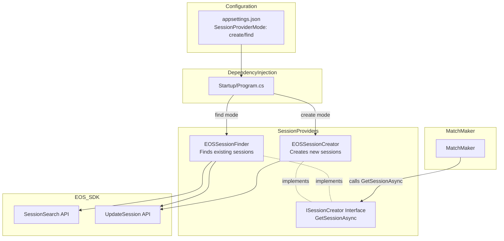

# Design Document: Session Finder for Existing Sessions

## Overview

This design adds an alternative implementation of the `ISessionCreator` interface that finds and claims existing empty EOS sessions instead of creating new ones. This supports architectural patterns where game servers or hosts pre-create sessions and the matchmaker assigns player groups to available sessions.

The system provides two session provider implementations:
- **EOSSessionCreator** (existing): Creates new sessions - suitable for P2P gameplay or when integrating with a dedicated server provider
- **EOSSessionFinder** (new): Finds existing sessions - suitable for player-hosted servers or dedicated servers that create their own sessions

Both implementations use the same interface, allowing operators to switch between patterns via configuration without code changes.

## Architecture

### Component Diagram



### Session Finding Flow

```mermaid
sequenceDiagram
    participant MM as MatchMaker
    participant SF as EOSSessionFinder
    participant EOS as EOS SDK
    
    MM->>SF: GetSessionAsync(match)
    SF->>EOS: CreateSessionSearch()
    EOS-->>SF: SessionSearch handle
    
    SF->>EOS: SetParameter(SEARCH_EMPTY_SERVERS_ONLY, true)
    SF->>EOS: SetParameter(bucket_id, "default")
    SF->>EOS: Find()
    
    alt Sessions found
        EOS-->>SF: Search results
        loop For each result
            SF->>EOS: CopySearchResultByIndex(i)
            EOS-->>SF: SessionDetails
            SF->>SF: Check if match_id attribute exists
            alt match_id not set (unclaimed)
                SF->>SF: Use this session
                Note over SF: Break loop
            else match_id set (already claimed)
                SF->>SF: Skip to next result
            end
        end
        
        alt Unclaimed session found
            SF->>EOS: UpdateSessionModification(sessionId)
        EOS-->>SF: SessionModification handle
        
        SF->>EOS: AddAttribute("match_id", matchId)
        SF->>EOS: AddAttribute("match_request_ids", requestIds)
        SF->>EOS: AddAttribute("claimed_at", timestamp)
        SF->>EOS: UpdateSession()
        
        alt Update successful
            EOS-->>SF: Success
            SF-->>MM: SessionInfo
        else Update failed (concurrent claim)
            EOS-->>SF: Error
            SF->>SF: Retry with next session
        end
    else No unclaimed sessions found
        EOS-->>SF: NotFound or all have match_id
        SF-->>MM: NoAvailableSessionsException
    end
```

## Components and Interfaces

### ISessionCreator Interface (Renamed Method)

```csharp
/// <summary>
/// Interface for obtaining game sessions for matched players.
/// Implementations may create new sessions or find existing ones.
/// </summary>
public interface ISessionCreator
{
    /// <summary>
    /// Get a session for the matched players.
    /// Implementations may create a new session or find an existing empty session.
    /// </summary>
    /// <param name="match">The match containing the players to get a session for</param>
    /// <returns>Information about the obtained session</returns>
    /// <exception cref="NoAvailableSessionsException">Thrown when no sessions are available (find mode only)</exception>
    /// <exception cref="SessionClaimFailedException">Thrown when session claiming fails after retries (find mode only)</exception>
    Task<SessionInfo> GetSessionAsync(Match match);
}
```

### EOSSessionFinder Implementation

```csharp
/// <summary>
/// Finds and claims existing empty EOS sessions for matched players.
/// Suitable for player-hosted servers or dedicated servers that create their own sessions.
/// </summary>
public class EOSSessionFinder : ISessionCreator
{
    private readonly ILogger<EOSSessionFinder> _logger;
    private readonly EOSSDKService _eosService;
    private readonly EOSSessionFinderConfig _config;

    public EOSSessionFinder(
        ILogger<EOSSessionFinder> logger,
        EOSSDKService eosService,
        EOSSessionFinderConfig config)
    {
        _logger = logger;
        _eosService = eosService;
        _config = config;
    }

    public async Task<SessionInfo> GetSessionAsync(Match match)
    {
        // Implementation details below
    }

    private async Task<SessionDetails?> SearchForEmptySessionAsync()
    {
        // Search for empty sessions using EOS SessionSearch API
        // Filter: zero players AND no match_id attribute
    }

    private async Task<bool> TryClaimSessionAsync(SessionDetails sessionDetails, Match match)
    {
        // Attempt to claim the session by updating its metadata
    }
}
```

### Configuration Classes

```csharp
public class EOSSessionFinderConfig
{
    /// <summary>
    /// Maximum number of retry attempts when session claiming fails due to concurrent access
    /// </summary>
    public int MaxRetryAttempts { get; set; } = 3;

    /// <summary>
    /// Session bucket identifier to filter search results
    /// </summary>
    public string BucketId { get; set; } = "default";

    /// <summary>
    /// Maximum number of search results to retrieve
    /// </summary>
    public int MaxSearchResults { get; set; } = 10;
}

public class SessionProviderConfig
{
    /// <summary>
    /// Session provider mode: "create" or "find"
    /// </summary>
    public string Mode { get; set; } = "create";

    /// <summary>
    /// Validate the configuration
    /// </summary>
    public void Validate()
    {
        if (Mode != "create" && Mode != "find")
        {
            throw new InvalidOperationException(
                $"Invalid SessionProviderMode '{Mode}'. Must be 'create' or 'find'.");
        }
    }
}
```

### Exception Classes

```csharp
/// <summary>
/// Exception thrown when no available sessions are found
/// </summary>
public class NoAvailableSessionsException : Exception
{
    public int SessionsSearched { get; }

    public NoAvailableSessionsException(int sessionsSearched)
        : base($"No available sessions found after searching {sessionsSearched} sessions")
    {
        SessionsSearched = sessionsSearched;
    }
}

/// <summary>
/// Exception thrown when session claiming fails after maximum retry attempts
/// </summary>
public class SessionClaimFailedException : Exception
{
    public int RetryAttempts { get; }

    public SessionClaimFailedException(int retryAttempts)
        : base($"Failed to claim session after {retryAttempts} retry attempts")
    {
        RetryAttempts = retryAttempts;
    }
}
```

## Data Models

### SessionInfo (Unchanged)

```csharp
public class SessionInfo
{
    public string SessionId { get; set; } = string.Empty;
    public List<string> RequestIds { get; set; } = new();
    public List<string> UserIds { get; set; } = new();
    public DateTime CreatedAt { get; set; }
}
```

### Session Metadata Attributes

When claiming a session, the following attributes are added/updated:

| Attribute Key | Type | Description |
|--------------|------|-------------|
| `match_id` | string | The match identifier |
| `match_request_ids` | string (JSON array) | List of matched request IDs |
| `claimed_at` | string (ISO 8601) | Timestamp when session was claimed |

## Implementation Details

### Session Search Process

1. Create a `SessionSearch` handle using `CreateSessionSearch()`
2. Set search parameters:
   - `SEARCH_EMPTY_SERVERS_ONLY` = true (only sessions with 0 players)
   - `bucket` = configured bucket ID
   - Exclude sessions with `match_id` attribute set (filter out claimed sessions)
3. Set max results to configured value
4. Call `Find()` to execute the search
5. Iterate through results using `GetSearchResultCount()` and `CopySearchResultByIndex()`
6. For each result, check if `match_id` attribute exists - skip if present

### Session Claiming Process

1. Extract session ID from `SessionDetails`
2. Create an `UpdateSessionModification` handle for the session
3. Add match metadata attributes:
   - `match_id`
   - `match_request_ids` (JSON serialized)
   - `claimed_at` (ISO 8601 timestamp)
4. Call `UpdateSession()` to apply the changes
5. Handle the async callback with platform ticking
6. If update fails (concurrent modification), retry with next session
7. If all retries exhausted, throw `SessionClaimFailedException`

### Concurrency Handling

The EOS SDK's `UpdateSession` operation provides optimistic concurrency control. If two matchmakers attempt to claim the same session simultaneously:

1. First update succeeds, session is claimed
2. Second update fails with an error
3. Second matchmaker retries with the next available session

This ensures no two matches claim the same session.

### Dependency Injection Setup

```csharp
// In Program.cs or Startup.cs
var sessionProviderConfig = builder.Configuration
    .GetSection("SessionProvider")
    .Get<SessionProviderConfig>() ?? new SessionProviderConfig();

sessionProviderConfig.Validate();

if (sessionProviderConfig.Mode == "create")
{
    builder.Services.AddSingleton<ISessionCreator, EOSSessionCreator>();
}
else // "find"
{
    var finderConfig = builder.Configuration
        .GetSection("SessionFinder")
        .Get<EOSSessionFinderConfig>() ?? new EOSSessionFinderConfig();
    
    builder.Services.AddSingleton(finderConfig);
    builder.Services.AddSingleton<ISessionCreator, EOSSessionFinder>();
}
```

### Configuration Example

```json
{
  "SessionProvider": {
    "Mode": "find"
  },
  "SessionFinder": {
    "MaxRetryAttempts": 3,
    "BucketId": "default",
    "MaxSearchResults": 10
  }
}
```

## Correctness Properties

The following properties describe the expected behavior of the session finder implementation. These will be validated through unit tests.

### Property 1: Session Search Returns Only Unclaimed Empty Sessions

*For any* session search executed by the Session_Finder, all returned sessions SHALL have zero registered players AND SHALL NOT have a match_id attribute set.

**Validates: Requirements 1.4, 6.1, 6.2**

### Property 2: Session Claim Updates Metadata

*For any* session successfully claimed by the Session_Finder, the session metadata SHALL contain the match_id, match_request_ids, and claimed_at attributes.

**Validates: Requirements 3.1, 3.2, 3.3, 3.4**

### Property 3: Concurrent Claims Are Mutually Exclusive

*For any* two concurrent GetSessionAsync operations, they SHALL NOT return the same session ID.

**Validates: Requirements 2.4**

### Property 4: Retry After Claim Failure

*For any* session claim that fails due to concurrent modification, the Session_Finder SHALL retry with a different session up to the configured maximum retry attempts.

**Validates: Requirements 2.3, 2.5**

### Property 5: No Available Sessions Throws Exception

*For any* GetSessionAsync call when no empty sessions exist, the Session_Finder SHALL throw NoAvailableSessionsException.

**Validates: Requirements 1.3, 5.1**

### Property 6: Max Retries Throws Exception

*For any* GetSessionAsync call where all retry attempts fail, the Session_Finder SHALL throw SessionClaimFailedException.

**Validates: Requirements 5.2**

### Property 7: Interface Compatibility

*For any* Match object, both EOSSessionCreator and EOSSessionFinder SHALL accept it as a parameter and return a SessionInfo object.

**Validates: Requirements 4.1, 4.2, 4.3**

### Property 8: Configuration Mode Selection

*For any* valid configuration with Mode="create", the dependency injection container SHALL provide EOSSessionCreator as the ISessionCreator implementation.

**Validates: Requirements 9.2**

### Property 9: Configuration Mode Selection (Find)

*For any* valid configuration with Mode="find", the dependency injection container SHALL provide EOSSessionFinder as the ISessionCreator implementation.

**Validates: Requirements 9.3**

### Property 10: Invalid Configuration Fails Fast

*For any* configuration with an invalid Mode value, the system SHALL throw an exception during startup before processing any requests.

**Validates: Requirements 9.5**

### Property 11: Bucket Filtering

*For any* session search, only sessions matching the configured BucketId SHALL be considered.

**Validates: Requirements 6.3**

### Property 12: Method Rename Compatibility

*For any* existing code calling CreateSessionAsync, after renaming to GetSessionAsync, the behavior SHALL remain unchanged for EOSSessionCreator.

**Validates: Requirements 8.2**

## Error Handling

### Error Scenarios

| Scenario | Exception | Logging | Recovery |
|----------|-----------|---------|----------|
| No empty sessions found | NoAvailableSessionsException | Log warning with search count | Return error to caller |
| Session claim fails (concurrent) | Retry with next session | Log retry attempt | Continue with next session |
| All retries exhausted | SessionClaimFailedException | Log error with retry count | Return error to caller |
| EOS SDK search error | InvalidOperationException | Log error with EOS result code | Return error to caller |
| Invalid configuration | InvalidOperationException | Log error at startup | Fail fast (don't start service) |

### Logging Strategy

```csharp
// Success
_logger.LogInformation("Found and claimed session: SessionId={SessionId}, MatchId={MatchId}, Attempts={Attempts}",
    sessionId, matchId, attemptCount);

// Retry
_logger.LogWarning("Session claim failed due to concurrent modification, retrying: Attempt={Attempt}/{MaxAttempts}",
    attemptCount, _config.MaxRetryAttempts);

// No sessions
_logger.LogWarning("No available empty sessions found: SessionsSearched={Count}",
    searchResultCount);

// Max retries
_logger.LogError("Failed to claim session after maximum retry attempts: Attempts={Attempts}",
    _config.MaxRetryAttempts);
```

## Testing Strategy

### Unit Tests

Unit tests will cover:
- Session search scenarios (0 sessions, 1 session, multiple sessions, all claimed)
- Filtering sessions with `match_id` attribute
- Claim success and failure paths
- Retry logic with different failure patterns
- Configuration validation
- Exception handling
- Logging verification
- Concurrent claim scenarios

### Mocking Strategy

- Mock EOS SDK `SessionsInterface` to simulate search results
- Mock `SessionSearch` to return controlled result sets
- Mock `UpdateSession` to simulate success/failure/concurrent modification
- Use test doubles to verify retry logic without actual EOS calls

### Integration Tests

Integration tests will verify the actual interaction with the EOS Sessions service:

**Test Setup:**
- Assume no existing sessions in EOS (clean state)
- Use real EOS SDK connection (not mocked)
- May require a test helper to create empty sessions without `match_id`

**Test Scenarios:**

1. **No Sessions Available**
   - Verify `GetSessionAsync` throws `NoAvailableSessionsException` when no sessions exist
   - Verify appropriate error logging

2. **Find and Claim Empty Sessions**
   - Create N empty sessions (without `match_id`) using a test helper
   - Call `GetSessionAsync` N times
   - Verify each call finds and claims a different session (no duplicates)
   - Verify each claimed session has `match_id`, `match_request_ids`, and `claimed_at` attributes set
   - Verify the (N+1)th call throws `NoAvailableSessionsException` (all sessions claimed)

3. **Sessions with match_id Are Excluded**
   - Create empty sessions with `match_id` already set
   - Verify `GetSessionAsync` does not return these sessions
   - Verify it throws `NoAvailableSessionsException` if only claimed sessions exist

4. **Optimistic Concurrency for Exclusive Claiming**
   - Create a single empty session
   - Start two concurrent `GetSessionAsync` calls (e.g., using `Task.WhenAll`)
   - Verify exactly one call succeeds and claims the session
   - Verify the other call either:
     - Finds a different session (if retry finds another), OR
     - Throws `NoAvailableSessionsException` (if no other sessions available)
   - Verify the claimed session has only one `match_id` (not overwritten)
   - Verify both calls never return the same session ID

**Test Helper Requirements:**
- Create a test utility that can create EOS sessions without setting `match_id`
- This may reuse parts of `EOSSessionCreator` but skip adding the `match_id` attribute
- Cleanup utility to destroy test sessions after tests complete

### Test Structure

```
src/
├── AccelByte.Extend.SimpleEOSMatchmaking.Server/
│   ├── Services/
│   │   ├── SessionCreator.cs (renamed method)
│   │   └── SessionFinder.cs (new)
│   ├── Classes/
│   │   ├── SessionProviderConfig.cs (new)
│   │   ├── EOSSessionFinderConfig.cs (new)
│   │   └── MatchmakingExceptions.cs (add new exceptions)
│   └── Program.cs (update DI setup)
└── AccelByte.Extend.SimpleEOSMatchmaking.Server.Tests/
    ├── Services/
    │   ├── SessionFinderTests.cs (new - unit tests)
    │   └── SessionFinderIntegrationTests.cs (new - integration tests)
    ├── Classes/
    │   └── SessionProviderConfigTests.cs (new)
    └── Helpers/
        └── EmptySessionTestHelper.cs (new - creates empty sessions for testing)
```

### Key Test Scenarios

1. **Session Search**: Empty sessions only, no match_id attribute, bucket filtering, max results
2. **Session Claiming**: Success, concurrent modification, retry logic
3. **Error Handling**: No sessions, all sessions claimed, max retries, EOS errors
4. **Configuration**: Valid modes, invalid modes, fail-fast behavior
5. **Interface Compatibility**: Both implementations work with MatchMaker
6. **Concurrency**: Multiple simultaneous claims don't conflict
7. **Metadata**: Claimed sessions contain correct attributes
8. **Filtering**: Sessions with match_id are excluded from search results
9. **Integration**: Real EOS SDK interaction for search and claim operations

## Documentation Updates

### README.md Section

A new section will be added to the project README explaining the two session provider modes:

```markdown
## Session Provider Modes

This matchmaking service supports two session provider modes to accommodate different architectural patterns:

### Create Mode (Default)

In "create" mode, the matchmaker creates new EOS sessions for each match.

**Use cases:**
- Peer-to-peer gameplay where matched players connect directly to each other
- Integration with a dedicated server provider that allocates servers after session creation

**Example flow:**
1. Players submit match requests
2. Matchmaker creates a match
3. Matchmaker creates a new EOS session
4. Players join the session and connect to each other (P2P) or wait for server allocation

**Configuration:**
```json
{
  "SessionProvider": {
    "Mode": "create"
  }
}
```

### Find Mode

In "find" mode, the matchmaker finds and claims existing empty EOS sessions.

**Use cases:**
- Player-hosted servers that create sessions and wait for players
- Dedicated servers that create their own sessions and register with EOS

**Example flow:**
1. Game servers create EOS sessions and mark them as empty
2. Players submit match requests
3. Matchmaker creates a match
4. Matchmaker finds an empty session and claims it for the match
5. Players join the claimed session

**Configuration:**
```json
{
  "SessionProvider": {
    "Mode": "find"
  },
  "SessionFinder": {
    "MaxRetryAttempts": 3,
    "BucketId": "default",
    "MaxSearchResults": 10
  }
}
```

### Extending with Dedicated Server Provider

The "create" mode can be extended to support dedicated servers by adding a dedicated server provider:

1. Create an `IDedicatedServerProvider` interface
2. Implement the interface to allocate servers from your server fleet
3. Modify `MatchMaker` to:
   - Create a match
   - Request a dedicated server from the provider
   - Create a session using "create" mode
   - Add server connection info to the session metadata

This allows the matchmaker to orchestrate both session creation and server allocation.

**Example pseudocode:**
```csharp
// In MatchMaker.TryMatchAsync()
var match = new Match(requestsForMatch);

// Allocate a dedicated server
var server = await _serverProvider.AllocateServerAsync();

// Create session with server info
var sessionInfo = await _sessionCreator.GetSessionAsync(match);
await AddServerInfoToSession(sessionInfo.SessionId, server);
```

This extension is not included in the sample but demonstrates how the architecture can be adapted to your needs.
```

