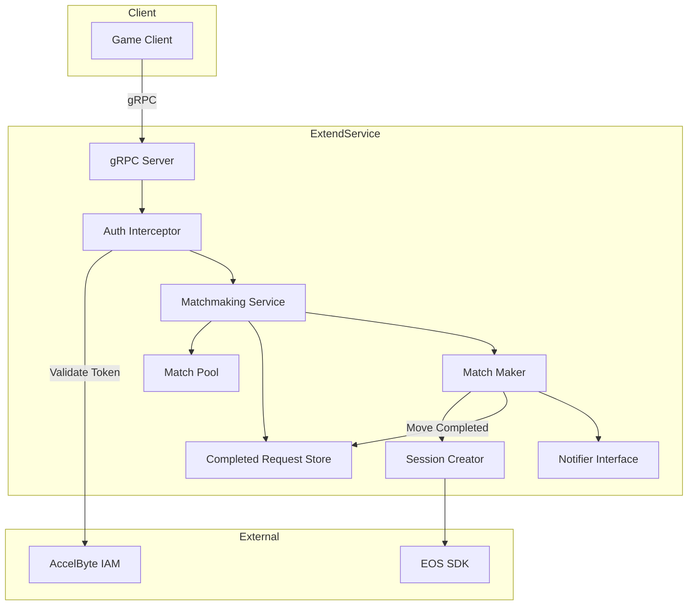

# Design Document: Simple Matchmaking

## Overview

This design describes a simple matchmaking system that allows players to submit match requests, get paired with other players using FIFO ordering, and have EOS sessions created for matched groups. The system is designed to be lightweight, in-memory, and easily extensible.

The matchmaking service is built using the AccelByte Extend Service Extension for C# template, which provides gRPC service infrastructure with AccelByte SDK integration. EOS sessions are created using the Epic Online Services SDK (available in C#).

## Architecture

### High-Level Architecture



### Request Flow

1. Client submits match request via gRPC endpoint
2. Auth interceptor validates bearer token with AccelByte IAM
3. Handler extracts user ID from token
4. Matchmaking service creates match request and adds to pool
5. Background matcher periodically checks pool for matches
6. When match found, session creator creates EOS session via SDK
7. Matched requests are moved to completed request store with retention period
8. Notifier interface is invoked with match details
9. Players can query status to get session details (from pool or completed store)
10. Completed requests are automatically cleaned up after retention period expires

## Components and Interfaces

### MatchmakingService

The main service implementing the gRPC endpoints for matchmaking operations.

```csharp
public interface IMatchmakingService
{
    // Submit a new match request
    Task<SubmitMatchRequestResponse> SubmitMatchRequest(SubmitMatchRequestRequest request, ServerCallContext context);
    
    // Get the status of a match request
    Task<GetMatchStatusResponse> GetMatchStatus(GetMatchStatusRequest request, ServerCallContext context);
    
    // Cancel a pending match request
    Task<CancelMatchRequestResponse> CancelMatchRequest(CancelMatchRequestRequest request, ServerCallContext context);
}
```

### MatchPool

Thread-safe in-memory storage for pending match requests.

```csharp
public interface IMatchPool
{
    // Add a new match request to the pool
    void Add(MatchRequest request);
    
    // Remove a match request by ID
    MatchRequest? Remove(string requestId);
    
    // Get a match request by ID
    MatchRequest? Get(string requestId);
    
    // Get a match request by user ID
    MatchRequest? GetByUserId(string userId);
    
    // Get oldest N requests for matching
    IReadOnlyList<MatchRequest> GetOldest(int count);
    
    // Remove expired requests and return them
    IReadOnlyList<MatchRequest> RemoveExpired(TimeSpan timeout);
    
    // Get count of pending requests
    int Count { get; }
}
```

### CompletedRequestStore

Thread-safe in-memory storage for completed match requests (matched, expired, cancelled) with automatic cleanup after retention period.

```csharp
public interface ICompletedRequestStore
{
    // Add a completed request to the store
    void Add(MatchRequest request);
    
    // Get a completed request by ID
    MatchRequest? Get(string requestId);
    
    // Remove requests that have exceeded the retention period
    IReadOnlyList<MatchRequest> RemoveExpired(TimeSpan retentionPeriod);
    
    // Get count of completed requests
    int Count { get; }
}

public class CompletedRequestStoreConfig
{
    public TimeSpan RetentionPeriod { get; set; } = TimeSpan.FromSeconds(120); // Default: 2 minutes
}
```

### MatchMaker

Background service that periodically checks the pool and creates matches.

```csharp
public interface IMatchMaker
{
    // Start the background matching process
    Task StartAsync(CancellationToken cancellationToken);
    
    // Stop the background matching process
    Task StopAsync(CancellationToken cancellationToken);
    
    // Attempt to create matches from the current pool (can be called manually)
    Task<IReadOnlyList<Match>> TryMatchAsync();
}

public class MatchMakerConfig
{
    public int MatchSize { get; set; } = 2;           // Number of players per match
    public TimeSpan TickInterval { get; set; } = TimeSpan.FromSeconds(1);  // How often to check
    public TimeSpan RequestTimeout { get; set; } = TimeSpan.FromSeconds(60); // Request expiration
    public TimeSpan RetentionPeriod { get; set; } = TimeSpan.FromSeconds(120); // Completed request retention
}
```

### SessionCreator

Interface for creating EOS sessions for matched players using the EOS SDK.

```csharp
public interface ISessionCreator
{
    // Create an EOS session for the matched players
    Task<SessionInfo> CreateSessionAsync(Match match);
}

public class SessionInfo
{
    public string SessionId { get; set; } = string.Empty;
    public List<string> RequestIds { get; set; } = new();
    public List<string> UserIds { get; set; } = new();
    public DateTime CreatedAt { get; set; }
}
```

### Notifier

Pluggable interface for notifying players when matches are found.

```csharp
public interface INotifier
{
    // Notify players that a match has been found
    Task NotifyMatchAsync(SessionInfo sessionInfo);
}

// Default no-op implementation that logs match events
public class LoggingNotifier : INotifier
{
    private readonly ILogger<LoggingNotifier> _logger;
    
    public Task NotifyMatchAsync(SessionInfo sessionInfo)
    {
        _logger.LogInformation("Match created: SessionId={SessionId}, Users={Users}", 
            sessionInfo.SessionId, string.Join(",", sessionInfo.UserIds));
        return Task.CompletedTask;
    }
}
```

## Data Models

### MatchRequest

```csharp
public class MatchRequest
{
    public string RequestId { get; set; } = Guid.NewGuid().ToString();
    public string UserId { get; set; } = string.Empty;
    public MatchRequestStatus Status { get; set; } = MatchRequestStatus.Pending;
    public DateTime CreatedAt { get; set; } = DateTime.UtcNow;
    public DateTime? MatchedAt { get; set; }
    public DateTime? CompletedAt { get; set; }  // When request reached terminal state
    public string? SessionId { get; set; }
    public Dictionary<string, string> Metadata { get; set; } = new();
}

public enum MatchRequestStatus
{
    Pending = 0,
    Matched = 1,
    Expired = 2,
    Cancelled = 3
}
```

### Match

```csharp
public class Match
{
    public string MatchId { get; set; } = Guid.NewGuid().ToString();
    public List<MatchRequest> Requests { get; set; } = new();
    public DateTime CreatedAt { get; set; } = DateTime.UtcNow;
}
```

### Proto Messages

```protobuf
message SubmitMatchRequestRequest {
    map<string, string> metadata = 1;  // Optional metadata
}

message SubmitMatchRequestResponse {
    string request_id = 1;
}

message GetMatchStatusRequest {
    string request_id = 1;
}

message GetMatchStatusResponse {
    string request_id = 1;
    MatchRequestStatus status = 2;
    string session_id = 3;           // Set if matched
    repeated string matched_user_ids = 4;  // Set if matched
    repeated string matched_request_ids = 5;  // Set if matched
}

enum MatchRequestStatus {
    PENDING = 0;
    MATCHED = 1;
    EXPIRED = 2;
    CANCELLED = 3;
}

message CancelMatchRequestRequest {
    string request_id = 1;
}

message CancelMatchRequestResponse {
    bool success = 1;
}
```


## Correctness Properties

*A property is a characteristic or behavior that should hold true across all valid executions of a system—essentially, a formal statement about what the system should do. Properties serve as the bridge between human-readable specifications and machine-verifiable correctness guarantees.*

### Property 1: Request ID Uniqueness

*For any* set of match requests submitted to the Matchmaking_Service, each request SHALL receive a unique Request_Identifier that is distinct from all other request identifiers in the system.

**Validates: Requirements 1.1**

### Property 2: Immediate Response with Request ID

*For any* valid match request submission, the response SHALL contain a non-empty Request_Identifier immediately upon submission.

**Validates: Requirements 1.2**

### Property 3: Duplicate User Rejection with Existing Request ID

*For any* user with a pending match request, submitting a new match request SHALL result in rejection with an error that includes the existing Request_Identifier, and the original request SHALL remain unchanged in the pool.

**Validates: Requirements 1.3**

### Property 4: Match Creation and Pool Invariant

*For any* Match_Pool containing N requests where N >= match_size, the MatchMaker SHALL create matches of exactly match_size players, and after matching, those matched requests SHALL no longer exist in the Match_Pool.

**Validates: Requirements 3.1, 3.3, 3.4**

### Property 5: FIFO Match Ordering

*For any* set of match requests, when creating matches, the MatchMaker SHALL always select the oldest pending requests first, such that no newer request is matched before an older compatible request.

**Validates: Requirements 3.2**

### Property 6: Session Creation with Request Identifiers

*For any* Match created by the MatchMaker, an EOS_Session SHALL be created, and the session metadata SHALL contain all Request_Identifiers from the matched requests.

**Validates: Requirements 4.1, 4.2**

### Property 7: Session Failure Recovery

*For any* Match where session creation fails, all Match_Requests from that match SHALL be returned to the Match_Pool with their original status restored to pending.

**Validates: Requirements 4.3**

### Property 8: Status Query Validity

*For any* valid Request_Identifier, querying the match status SHALL return one of the valid statuses: pending, matched, expired, or cancelled.

**Validates: Requirements 5.1**

### Property 9: Matched Status Contains Session Details

*For any* Match_Request with status "matched", querying its status SHALL return the associated EOS_Session ID and the list of matched user IDs and request IDs.

**Validates: Requirements 5.2**

### Property 10: Unknown Request ID Error

*For any* Request_Identifier that does not exist in the system, querying its status SHALL return a not found error.

**Validates: Requirements 5.3**

### Property 11: Cancellation Removes and Confirms

*For any* pending Match_Request, cancellation SHALL remove the request from the Match_Pool and return a confirmation of successful cancellation.

**Validates: Requirements 6.1, 6.2**

### Property 12: Cannot Cancel Matched Request

*For any* Match_Request with status "matched", attempting to cancel SHALL return an error indicating the request is no longer pending.

**Validates: Requirements 6.3**

### Property 13: Expiration Updates Status and Removes from Pool

*For any* Match_Request that has been pending longer than the configured timeout, the request SHALL be removed from the Match_Pool and its status SHALL be updated to "expired".

**Validates: Requirements 7.1, 7.3**

### Property 14: Notifier Receives Complete Match Information

*For any* Match created by the MatchMaker, the Notifier interface SHALL be invoked with the EOS_Session ID, all matched user IDs, and all matched Request_Identifiers.

**Validates: Requirements 8.1, 8.3**

### Property 15: Terminal State Moves to Completed Store

*For any* Match_Request that reaches a terminal state (matched, expired, or cancelled), the request SHALL be moved to the Completed_Request_Store and SHALL no longer exist in the Match_Pool.

**Validates: Requirements 6.1**

### Property 16: Completed Requests Queryable Within Retention Period

*For any* completed Match_Request where the time since completion is less than the Retention_Period, querying the request status SHALL successfully return the request details.

**Validates: Requirements 6.2**

### Property 17: Expired Completed Requests Removed

*For any* completed Match_Request where the time since completion exceeds the Retention_Period, the request SHALL be removed from the Completed_Request_Store.

**Validates: Requirements 6.3**

### Property 18: Retention Period Configuration Respected

*For any* configured Retention_Period value, completed requests SHALL remain queryable for exactly that duration before being removed.

**Validates: Requirements 6.4**

### Property 19: Completed Request Query Consistency

*For any* completed Match_Request within the Retention_Period, the status query response SHALL contain the same fields (status, session_id, matched_user_ids, matched_request_ids) as would be returned if the request were still in the Match_Pool.

**Validates: Requirements 6.5**

## Error Handling

### Error Codes

| Error Code | gRPC Code | Description |
|------------|-----------|-------------|
| 40001 | InvalidArgument | Invalid request parameters |
| 40101 | Unauthenticated | Missing or invalid authentication token |
| 40301 | FailedPrecondition | User already has a pending match request (includes existing request_id in error details) |
| 40302 | FailedPrecondition | Cannot cancel - request already matched |
| 40401 | NotFound | Match request not found |
| 50001 | Internal | Session creation failed |
| 50002 | Internal | Internal matchmaking error |

### Error Response for Duplicate Request

When a user submits a match request while already having a pending request, the error response SHALL include the existing request ID:

```csharp
public class DuplicateRequestException : Exception
{
    public string ExistingRequestId { get; }
    
    public DuplicateRequestException(string existingRequestId)
        : base($"User already has a pending match request: {existingRequestId}")
    {
        ExistingRequestId = existingRequestId;
    }
}
```

The gRPC error will include this in the error details, allowing clients to retrieve their existing request ID.

### Error Handling Strategy

1. **Validation Errors**: Return immediately with descriptive error message
2. **Authentication Errors**: Handled by auth interceptor before reaching service
3. **Duplicate Request**: Check pool for existing user request before adding
4. **Session Creation Failure**: Return requests to pool, log error, retry on next tick
5. **Cancellation of Matched Request**: Return error with current status

## Testing Strategy

### Property-Based Testing

Property-based tests will be implemented using FsCheck (a .NET PBT library) to verify the correctness properties defined above.

**Configuration**:
- Minimum 100 iterations per property test
- Each test tagged with: **Feature: simple-matchmaking, Property {number}: {property_text}**

**Generator Strategy**:
- Generate random user IDs (GUIDs)
- Generate random metadata dictionaries
- Generate random sequences of operations (submit, cancel, query)
- Generate random timing for expiration tests

### Unit Tests

Unit tests complement property tests by covering:
- Specific edge cases (empty pool, single request, exact match_size requests)
- Error conditions (invalid IDs, authentication failures)
- Integration points (session creator mock, notifier mock)
- Configuration variations (different match sizes, timeouts)

### Test Structure

```
src/
├── AccelByte.Extend.SimpleEOSMatchmaking.Server/
│   ├── Services/
│   │   ├── MatchmakingService.cs
│   │   ├── MatchPool.cs
│   │   ├── CompletedRequestStore.cs
│   │   ├── MatchMaker.cs
│   │   ├── SessionCreator.cs
│   │   └── Notifier.cs
│   ├── Model/
│   │   ├── MatchRequest.cs
│   │   └── Match.cs
│   └── Classes/
│       └── MatchmakingExceptions.cs
└── AccelByte.Extend.SimpleEOSMatchmaking.Server.Tests/
    ├── MatchPoolTests.cs
    ├── MatchPoolPropertyTests.cs
    ├── CompletedRequestStoreTests.cs
    ├── CompletedRequestStorePropertyTests.cs
    ├── MatchMakerTests.cs
    ├── MatchMakerPropertyTests.cs
    ├── MatchmakingServiceTests.cs
    └── MatchmakingServicePropertyTests.cs
```

### Key Test Scenarios

1. **Submit Request**: Valid submission, duplicate rejection, response format
2. **Matching**: FIFO ordering, correct match size, pool cleanup
3. **Session Creation**: Success path, failure recovery
4. **Status Query**: All status types, unknown ID handling, completed request queries
5. **Cancellation**: Success, already matched error
6. **Expiration**: Timeout behavior, status update
7. **Notification**: Notifier invocation, parameter correctness
8. **Retention**: Completed request storage, retention period expiration, query consistency
