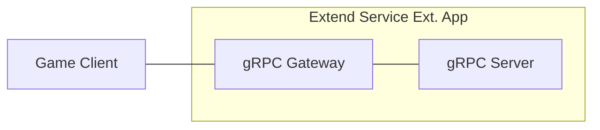

# Simple EOS Matchmaking Service



`AccelByte Gaming Services` (AGS) capabilities can be enhanced using `Extend Service Extension` apps. An `Extend Service Extension` app is a RESTful web service created using a stack that includes a `gRPC Server` and the [gRPC Gateway](https://github.com/grpc-ecosystem/grpc-gateway?tab=readme-ov-file#about).

## Overview

This repository provides a simple matchmaking service implemented as an `Extend Service Extension` app written in `C#`. It includes a matchmaking service with three endpoints to submit match requests, check match status, and cancel pending requests. The service uses Epic Online Services (EOS) SDK for session creation and includes built-in instrumentation for observability.

## Documentation

**📚 Complete Documentation:**
- **[Setup Guide](docs/setup.md)** - Prerequisites, configuration, and deployment
- **[Architecture Guide](docs/architecture.md)** - Technical design, components, and extensibility
- **[Operations Guide](docs/operations.md)** - Testing, monitoring, and troubleshooting
- **[Testing Guide](docs/testing_guide.md)** - Manual testing procedures
- **[Dev Container Guide](docs/devcontainer.md)** - Using Dev Containers and GitHub Codespaces

## Key Features

- **Automatic Matching** - Background service matches players based on configurable match size
- **EOS Session Creation** - Creates EOS sessions for matched players with session details
- **Request Management** - Submit, query status, and cancel match requests
- **Request Timeout** - Automatic expiration after configurable timeout period
- **Built-in Observability** - Metrics, distributed tracing, and structured logging
- **Extensible Design** - Clear extension points for custom notification and session logic

## Quick Start

### Prerequisites

- **Development Tools**: Bash, Make, Docker, .NET 8 SDK, Postman, extend-helper-cli
- **AccelByte Account**: AGS environment with namespace and OAuth client
- **EOS Account**: Epic Games Developer Portal account with Product credentials
- **EOS SDK**: Download and place in `EOS-SDK/` directory (see Setup Guide)

> See [Setup Guide](docs/setup.md) for detailed prerequisites and installation instructions.

### Setup Steps

1. **Download EOS SDK** and place in `EOS-SDK/` directory (see [Setup Guide](docs/setup.md#downloading-the-eos-sdk))

2. **Create environment file:**
   ```bash
   cp .env.template .env
   ```

3. **Configure credentials** in `.env`:
   ```bash
   # AccelByte Configuration
   AB_BASE_URL=https://test.accelbyte.io
   AB_CLIENT_ID=your-client-id
   AB_CLIENT_SECRET=your-client-secret
   AB_NAMESPACE=your-namespace
   
   # EOS Configuration
   EOS_PRODUCT_ID=your-product-id
   EOS_SANDBOX_ID=your-sandbox-id
   EOS_DEPLOYMENT_ID=your-deployment-id
   EOS_CLIENT_ID=your-eos-client-id
   EOS_CLIENT_SECRET=your-eos-client-secret
   ```

4. **Build and run:**
   ```bash
   docker compose up --build
   ```

5. **Access the service:**
   - **Swagger UI**: `http://localhost:8000/matchmaking/apidocs/`
   - **REST API**: `http://localhost:8000/matchmaking`
   - **Metrics**: `http://localhost:8080/metrics`

> See [Setup Guide](docs/setup.md) for complete configuration options and deployment instructions.

## API Endpoints

The service exposes three gRPC endpoints (also available as REST via gRPC Gateway):

| Endpoint | Purpose | Returns |
|----------|---------|---------|
| **SubmitMatchRequest** | Submit new matchmaking request | Request ID for tracking |
| **GetMatchStatus** | Query request status | Status (Pending/Matched/Expired/Cancelled) + session details |
| **CancelMatchRequest** | Cancel pending request | Confirmation of cancellation |

> See [Testing Guide](docs/testing_guide.md) for detailed API usage and testing scenarios.

## Testing

### Run Automated Tests

```bash
docker compose up --build
dotnet test src/extend-service-extension-server.sln
```

### Manual Testing

1. **Get access token** using [demo/get-access-token.postman_collection.json](demo/get-access-token.postman_collection.json)
2. **Test endpoints** using [demo/matchmaking-service-demo.postman_collection.json](demo/matchmaking-service-demo.postman_collection.json)
3. **Or use Swagger UI** at `http://localhost:8000/matchmaking/apidocs/`

> See [Testing Guide](docs/testing_guide.md) for comprehensive testing instructions.

## Configuration

### Basic Configuration

The service requires EOS credentials and optionally accepts matchmaking tuning parameters:

```bash
# Required: EOS Credentials
EOS_PRODUCT_ID=your-product-id
EOS_SANDBOX_ID=your-sandbox-id
EOS_DEPLOYMENT_ID=your-deployment-id
EOS_CLIENT_ID=your-eos-client-id
EOS_CLIENT_SECRET=your-eos-client-secret

# Optional: Matchmaking Tuning (defaults shown)
MATCHMAKER__MATCHSIZE=2                    # Players per match
MATCHMAKER__TICKINTERVALSECONDS=1          # Matching frequency
MATCHMAKER__REQUESTTIMEOUTSECONDS=60       # Request expiration time
```

### Session Provider Modes

The service supports two modes for session management:

- **create mode (Default)**: Matchmaker creates new EOS sessions for each match
- **find mode**: Matchmaker finds existing available EOS sessions created by game servers

```bash
SESSIONPROVIDER__MODE=create  # or "find"
```

> See [Architecture Guide](docs/architecture.md#session-provider-modes) for detailed mode explanations and use cases.

> See [Setup Guide](docs/setup.md) for complete configuration reference.

## Architecture

### Core Components

- **MatchmakingService** - gRPC service handling client requests
- **MatchPool** - Thread-safe in-memory storage for pending requests
- **MatchMaker** - Background service that periodically creates matches
- **SessionCreator** - Creates or finds EOS sessions for matched players
- **PlayerNotifier** - Extensible notification mechanism for match events

### Matching Algorithm

The matcher uses a **FIFO (First-In-First-Out)** algorithm:
1. Every tick interval, check the pool for pending requests
2. Take the oldest N requests (where N = MatchSize)
3. Create an EOS session for those players
4. Update request statuses to "MATCHED" with session details

### Request Lifecycle

```
Submit → PENDING → (matched) → MATCHED
              ↓
              (timeout) → EXPIRED
              ↓
              (cancel) → CANCELLED
```

> See [Architecture Guide](docs/architecture.md) for detailed technical architecture, design decisions, and extensibility patterns.

## Extensibility

The service provides clear extension points for customization:

### Application-Level Extension Points

- **IPlayerNotifier** - Custom player notification (webhooks, push notifications, message queues)
- **ISessionCreator** - Custom session logic (create vs find modes)
- **ISessionOwnerNotifier** - Notify game servers when sessions are claimed (find mode only)

### Infrastructure-Level Extension Points
Replace in memory implementation with durable storage (e.g. Redis, DB) for multi-instance deployments

- **IMatchPool**
- **ICompletedRequestStore** 
- **IClaimedSessionsCache**

### Core Customization

The **MatchMaker** class can be modified directly to implement custom matching logic:
- Skill-based matching (ELO/MMR)
- Region-based matching
- Team balancing algorithms
- Metadata filtering

> See [Architecture Guide](docs/architecture.md) for complete extensibility documentation with working code examples.

## Deployment

### Deploy to AccelByte

1. **Create Extend Service Extension app** in AGS Admin Portal
2. **Configure secrets** (AB_CLIENT_ID, AB_CLIENT_SECRET, EOS credentials)
3. **Build and push image:**
   ```bash
   extend-helper-cli image-upload --login --namespace <namespace> --app <app-name> --image-tag v0.0.1
   ```
4. **Deploy image** from Admin Portal

> See [Setup Guide](docs/setup.md) for detailed deployment instructions and multi-instance considerations.

## Project Structure

```
src/
├── AccelByte.Extend.SimpleEOSMatchmaking.Server/
│   ├── Classes/          # Infrastructure & cross-cutting concerns
│   ├── Model/            # Domain data structures
│   ├── Services/         # Business logic & application services
│   ├── Protos/           # gRPC service definitions
│   └── Program.cs        # Dependency injection setup
├── AccelByte.Extend.SimpleEOSMatchmaking.Server.Tests/
│   └── ...               # Unit tests (71 tests)
└── extend-service-extension-server.sln
```

## Observability

The service includes production-ready observability:

- **Metrics** - Prometheus metrics at `:8080/metrics`
- **Tracing** - OpenTelemetry distributed tracing (Zipkin export)
- **Logging** - Structured logging with Microsoft.Extensions.Logging

> See [Operations Guide](docs/operations.md) for observability setup and monitoring.

## License

See [LICENSE](LICENSE) file for details.

## Support

For issues, questions, or contributions, please refer to the AccelByte documentation or contact support.
