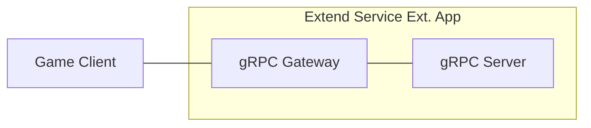

# Simple EOS Matchmaking Service



`AccelByte Gaming Services` (AGS) capabilities can be enhanced using 
`Extend Service Extension` apps. An `Extend Service Extension` app is a RESTful 
web service created using a stack that includes a `gRPC Server` and the 
[gRPC Gateway](https://github.com/grpc-ecosystem/grpc-gateway?tab=readme-ov-file#about).

## Overview

This repository provides a simple matchmaking service implemented as an `Extend Service Extension` 
app written in `C#`. It includes a matchmaking service with three endpoints to submit match requests, 
check match status, and cancel pending requests. The service uses Epic Online Services (EOS) SDK 
for session creation and includes built-in instrumentation for observability, ensuring that metrics, 
traces, and logs are available upon deployment.

## Documentation

- **[Setup Guide](docs/setup.md)** - Complete setup, configuration, and deployment instructions
- **[Architecture Guide](docs/architecture.md)** - Technical architecture and design decisions
- **[Operations Guide](docs/operations.md)** - Testing, monitoring, and troubleshooting
- **[Testing Guide](docs/testing_guide.md)** - Comprehensive manual testing instructions
- **[Dev Container Guide](docs/devcontainer.md)** - Using Dev Containers and GitHub Codespaces

### Matchmaking Features

- **Submit Match Request**: Players submit matchmaking requests and receive a unique request ID
- **Get Match Status**: Query the status of a match request (Pending, Matched, Expired, Cancelled)
- **Cancel Match Request**: Cancel a pending match request before it's matched
- **Automatic Matching**: Background service automatically matches players based on configured match size
- **EOS Session Creation**: Matched players are placed into EOS sessions with session details returned
- **Request Timeout**: Requests automatically expire after a configurable timeout period

### API Endpoints

The matchmaking service exposes three gRPC endpoints (also available as REST via gRPC Gateway):

1. **SubmitMatchRequest**
   - Submits a new matchmaking request for the authenticated user
   - Returns a unique request ID for tracking
   - Rejects duplicate requests from the same user

2. **GetMatchStatus**
   - Queries the status of a match request by request ID
   - Returns status (Pending, Matched, Expired, Cancelled)
   - Includes session details when matched

3. **CancelMatchRequest**
   - Cancels a pending match request
   - Only pending requests can be cancelled
   - Returns confirmation of cancellation

## Project Structure

The matchmaking service is implemented with the following key components:

```shell
.
├── src
│   ├── AccelByte.Extend.SimpleEOSMatchmaking.Server
│   │   ├── AccelByte.Extend.SimpleEOSMatchmaking.Server.csproj
│   │   ├── Classes                           # Infrastructure & cross-cutting concerns
│   │   │   ├── AuthorizationInterceptor.cs   # gRPC server interceptor for access token authentication and authorization
│   │   │   ├── EOSConfig.cs                  # EOS SDK configuration
│   │   │   ├── EOSSDKService.cs              # EOS SDK initialization and lifecycle management
│   │   │   ├── MatchmakingExceptions.cs      # Custom exception types for matchmaking
│   │   │   └── ...
│   │   ├── Model                             # Domain data structures
│   │   │   ├── Match.cs                      # Match data model
│   │   │   ├── MatchRequest.cs               # Match request data model with status enum
│   │   │   └── SessionInfo.cs                # Session information data model
│   │   ├── Program.cs                        # App starts here, dependency injection setup
│   │   ├── Protos
│   │   │   ├── matchmaking.proto             # gRPC matchmaking service definition
│   │   │   └── ...
│   │   ├── Services                          # Business logic & application services
│   │   │   ├── MatchMaker.cs                 # Background service for automatic matching
│   │   │   ├── MatchmakingService.cs         # gRPC service implementation
│   │   │   ├── MatchPool.cs                  # Thread-safe in-memory match request storage
│   │   │   ├── Notifier.cs                   # Match notification interface and implementation
│   │   │   └── SessionCreator.cs             # EOS session creation interface and implementation
│   ├── AccelByte.Extend.SimpleEOSMatchmaking.Server.Tests
│   │   └── ...                               # Unit tests for all components (71 tests)
│   └── extend-service-extension-server.sln
└── ...
```

### Code Organization

- **Model/** - Domain entities and data structures (Match, MatchRequest)
- **Services/** - Business logic and orchestration (MatchMaker, MatchPool, MatchmakingService)
- **Classes/** - Infrastructure, middleware, and SDK integrations (Interceptors, EOS SDK wrapper)

## Configuration

The matchmaking service can be configured via `appsettings.json` or environment variables:

### MatchMaker Configuration

```json
{
  "MatchMaker": {
    "MatchSize": 2,                    // Number of players per match
    "TickIntervalSeconds": 1,          // How often the matcher runs (in seconds)
    "RequestTimeoutSeconds": 60        // How long before requests expire (in seconds)
  }
}
```

### EOS Configuration

```json
{
  "EOS": {
    "ProductId": "your-product-id",
    "SandboxId": "your-sandbox-id",
    "DeploymentId": "your-deployment-id",
    "ClientId": "your-client-id",
    "ClientSecret": "your-client-secret"
  }
}
```

## Quick Start

### Prerequisites

- **Development Tools**: Bash, Make, Docker, .NET 8 SDK, Postman, extend-helper-cli
- **AccelByte Account**: AGS environment with namespace and OAuth client
- **EOS Account**: Epic Games Developer Portal account with Product credentials

> See [Setup Guide](docs/setup.md) for detailed prerequisites and installation instructions.

### Setup

1. **Create environment file:**
   ```bash
   cp .env.template .env
   ```

2. **Configure environment variables** in `.env`:
   ```bash
   AB_BASE_URL=https://test.accelbyte.io
   AB_CLIENT_ID=xxxxxxxxxx
   AB_CLIENT_SECRET=xxxxxxxxxx
   AB_NAMESPACE=xxxxxxxxxx
   PLUGIN_GRPC_SERVER_AUTH_ENABLED=true
   BASE_PATH=/matchmaking
   
   EOS_PRODUCT_ID=xxxxxxxxxx
   EOS_SANDBOX_ID=xxxxxxxxxx
   EOS_DEPLOYMENT_ID=xxxxxxxxxx
   EOS_CLIENT_ID=xxxxxxxxxx
   EOS_CLIENT_SECRET=xxxxxxxxxx
   ```

3. **Build and run:**
   ```bash
   docker compose up --build
   ```

4. **Access Swagger UI:**
   ```
   http://localhost:8000/matchmaking/apidocs/
   ```

> See [Setup Guide](docs/setup.md) for detailed configuration options and deployment instructions.

## Testing

### Running Unit Tests

```bash
dotnet test src/extend-service-extension-server.sln
```

### Manual Testing

1. **Get access token** using [demo/get-access-token.postman_collection.json](demo/get-access-token.postman_collection.json)
2. **Test matchmaking endpoints** using [demo/matchmaking-service-demo.postman_collection.json](demo/matchmaking-service-demo.postman_collection.json)
3. **Or use Swagger UI** at `http://localhost:8000/matchmaking/apidocs/`
4. **Authorize** with `Bearer <access_token>`
5. **Test scenarios:**
   - Submit match requests from multiple users
   - Check match status (should show MATCHED when enough players join)
   - Cancel pending requests
   - Test request timeout (wait 60 seconds)

> See [Testing Guide](docs/testing_guide.md) for comprehensive testing instructions and scenarios.

## Deployment

1. **Create Extend Service Extension app** in AGS Admin Portal
2. **Configure secrets** (AB_CLIENT_ID, AB_CLIENT_SECRET, EOS credentials)
3. **Build and push image:**
   ```bash
   extend-helper-cli image-upload --login --namespace <namespace> --app <app-name> --image-tag v0.0.1
   ```
4. **Deploy image** from Admin Portal

> See [Setup Guide](docs/setup.md) for detailed deployment instructions.

## Architecture

### Core Components

- **MatchmakingService**: gRPC service handling client requests
- **MatchPool**: Thread-safe in-memory storage for pending match requests
- **MatchMaker**: Background service that periodically creates matches from the pool
- **SessionCreator**: Creates EOS sessions for matched players
- **Notifier**: Logs match events (extensible for webhooks/notifications)

### Matching Algorithm

The matcher uses a simple **FIFO (First-In-First-Out)** algorithm:
1. Every tick interval (default: 1 second), the matcher checks the pool
2. Takes the oldest N requests (where N = MatchSize)
3. Creates an EOS session for those players
4. Updates request statuses to "MATCHED" with session details
5. If session creation fails, requests are returned to the pool

### Request Lifecycle

```
Submit → PENDING → (matched) → MATCHED
              ↓
              (timeout) → EXPIRED
              ↓
              (cancel) → CANCELLED
```

> See [Architecture Guide](docs/architecture.md) for detailed technical architecture and design decisions.

### Notifier Extensibility

The `INotifier` interface provides an extensibility point for notifying players when matches are found. The current implementation (`LoggingNotifier`) logs match events to the console.

**Custom Implementation Example:**

```csharp
public class WebhookNotifier : INotifier
{
    private readonly HttpClient _httpClient;
    private readonly string _webhookUrl;

    public async Task NotifyMatchAsync(SessionInfo sessionInfo)
    {
        var payload = new {
            session_id = sessionInfo.SessionId,
            player_ids = sessionInfo.UserIds,
            timestamp = DateTime.UtcNow
        };
        
        await _httpClient.PostAsJsonAsync(_webhookUrl, payload);
    }
}
```

To use a custom notifier, register it in `Program.cs`:
```csharp
builder.Services.AddSingleton<INotifier, WebhookNotifier>();
```

> See [Architecture Guide](docs/architecture.md) for more extensibility examples and patterns.


