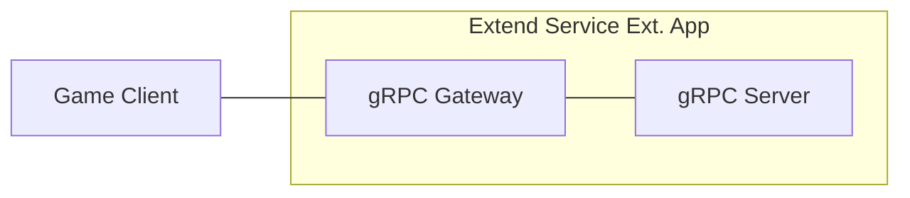

# Simple EOS Matchmaking Service



`AccelByte Gaming Services` (AGS) capabilities can be enhanced using 
`Extend Service Extension` apps. An `Extend Service Extension` app is a RESTful 
web service created using a stack that includes a `gRPC Server` and the 
[gRPC Gateway](https://github.com/grpc-ecosystem/grpc-gateway?tab=readme-ov-file#about).

## Overview

This repository provides a simple matchmaking service implemented as an `Extend Service Extension` 
app written in `C#`. It includes a matchmaking service with three endpoints to submit match requests, 
check match status, and cancel pending requests. The service uses Epic Online Services (EOS) SDK 
for session creation and includes built-in instrumentation for observability, ensuring that metrics, 
traces, and logs are available upon deployment.

### Matchmaking Features

- **Submit Match Request**: Players submit matchmaking requests and receive a unique request ID
- **Get Match Status**: Query the status of a match request (Pending, Matched, Expired, Cancelled)
- **Cancel Match Request**: Cancel a pending match request before it's matched
- **Automatic Matching**: Background service automatically matches players based on configured match size
- **EOS Session Creation**: Matched players are placed into EOS sessions with session details returned
- **Request Timeout**: Requests automatically expire after a configurable timeout period

### API Endpoints

The matchmaking service exposes three gRPC endpoints (also available as REST via gRPC Gateway):

1. **SubmitMatchRequest**
   - Submits a new matchmaking request for the authenticated user
   - Returns a unique request ID for tracking
   - Rejects duplicate requests from the same user

2. **GetMatchStatus**
   - Queries the status of a match request by request ID
   - Returns status (Pending, Matched, Expired, Cancelled)
   - Includes session details when matched

3. **CancelMatchRequest**
   - Cancels a pending match request
   - Only pending requests can be cancelled
   - Returns confirmation of cancellation

## Project Structure

The matchmaking service is implemented with the following key components:

```shell
.
├── src
│   ├── AccelByte.Extend.SimpleEOSMatchmaking.Server
│   │   ├── AccelByte.Extend.SimpleEOSMatchmaking.Server.csproj
│   │   ├── Classes
│   │   │   ├── AuthorizationInterceptor.cs   # gRPC server interceptor for access token authentication and authorization
│   │   │   ├── EOSConfig.cs                  # EOS SDK configuration
│   │   │   ├── EOSSDKService.cs              # EOS SDK initialization and lifecycle management
│   │   │   ├── MatchmakingExceptions.cs      # Custom exception types for matchmaking
│   │   │   └── ...
│   │   ├── Model
│   │   │   ├── Match.cs                      # Match data model
│   │   │   └── MatchRequest.cs               # Match request data model with status enum
│   │   ├── Program.cs                        # App starts here, dependency injection setup
│   │   ├── Protos
│   │   │   ├── matchmaking.proto             # gRPC matchmaking service definition
│   │   │   └── ...
│   │   ├── Services
│   │   │   ├── MatchMaker.cs                 # Background service for automatic matching
│   │   │   ├── MatchmakingService.cs         # gRPC service implementation
│   │   │   ├── MatchPool.cs                  # Thread-safe in-memory match request storage
│   │   │   ├── Notifier.cs                   # Match notification interface and implementation
│   │   │   └── SessionCreator.cs             # EOS session creation interface and implementation
│   ├── AccelByte.Extend.SimpleEOSMatchmaking.Server.Tests
│   │   └── ...                               # Unit tests for all components (71 tests)
│   └── extend-service-extension-server.sln
└── ...
```

## Configuration

The matchmaking service can be configured via `appsettings.json` or environment variables:

### MatchMaker Configuration

```json
{
  "MatchMaker": {
    "MatchSize": 2,                    // Number of players per match
    "TickIntervalSeconds": 1,          // How often the matcher runs (in seconds)
    "RequestTimeoutSeconds": 60        // How long before requests expire (in seconds)
  }
}
```

### EOS Configuration

```json
{
  "EOS": {
    "ProductId": "your-product-id",
    "SandboxId": "your-sandbox-id",
    "DeploymentId": "your-deployment-id",
    "ClientId": "your-client-id",
    "ClientSecret": "your-client-secret"
  }
}
```

## Prerequisites

1. Windows 11 WSL2 or Linux Ubuntu 22.04 or macOS 14+ with the following tools installed:

   a. Bash

      - On Windows WSL2 or Linux Ubuntu:

         ```
         bash --version

         GNU bash, version 5.1.16(1)-release (x86_64-pc-linux-gnu)
         ...
         ```

      - On macOS:

         ```
         bash --version

         GNU bash, version 3.2.57(1)-release (arm64-apple-darwin23)
         ...
         ```

   b. Make

      - On Windows WSL2 or Linux Ubuntu:

         To install from the Ubuntu repository, run `sudo apt update && sudo apt install make`.

         ```
         make --version

         GNU Make 4.3
         ...
         ```

      - On macOS:

         ```
         make --version

         GNU Make 3.81
         ...
         ```

   c. Docker (Docker Desktop 4.30+/Docker Engine v23.0+)
   
      - On Linux Ubuntu:

         1. To install from the Ubuntu repository, run `sudo apt update && sudo apt install docker.io docker-buildx docker-compose-v2`.
         2. Add your user to the `docker` group: `sudo usermod -aG docker $USER`.
         3. Log out and log back in to allow the changes to take effect.

      - On Windows or macOS:

         Follow Docker's documentation on installing the Docker Desktop on [Windows](https://docs.docker.com/desktop/install/windows-install/) or [macOS](https://docs.docker.com/desktop/install/mac-install/).

         ```
         docker version

         ...
         Server: Docker Desktop
            Engine:
            Version:          24.0.5
         ...
         ```

   d. .NET 8 SDK

      - On Linux Ubuntu:

         To install from the Ubuntu repository, run `sudo apt-get update && sudo apt-get install -y dotnet-sdk-8.0`.

      - On Windows or macOS:

         Follow Microsoft's documentation for installing .NET on [Windows](https://learn.microsoft.com/en-us/dotnet/core/install/windows) or on [macOS](https://learn.microsoft.com/en-us/dotnet/core/install/macos).

         ```
         dotnet --version
         
         8.0.119
         ```

   e. [Postman](https://www.postman.com/)

      - Use binary available [here](https://www.postman.com/downloads/)

   f. [extend-helper-cli](https://github.com/AccelByte/extend-helper-cli)

      - Use the available binary from [extend-helper-cli](https://github.com/AccelByte/extend-helper-cli/releases).

   > :exclamation: In macOS, you may use [Homebrew](https://brew.sh/) to easily install some of the tools above.

2. Access to AGS environment.

   a. Base URL:

      - Sample URL for AGS Shared Cloud customers: `https://spaceshooter.prod.gamingservices.accelbyte.io`
      - Sample URL for AGS Private Cloud customers:  `https://dev.accelbyte.io`

   b. [Create a Game Namespace](https://docs.accelbyte.io/gaming-services/services/access/reference/namespaces/manage-your-namespaces/) if you don't have one yet. Keep the `Namespace ID`. Make sure this namespace is in active status.

   c. [Create an OAuth Client](https://docs.accelbyte.io/gaming-services/services/access/authorization/manage-access-control-for-applications/#create-an-iam-client) 
      with confidential client type with the following permissions. Keep the 
      `Client ID` and `Client Secret`.

      - For AGS Private Cloud customers:
         - `ADMIN:ROLE [READ]` to validate access token and permissions
         - `ADMIN:NAMESPACE:{namespace}:NAMESPACE [READ]` to validate access namespace
      - For AGS Shared Cloud customers:
         - IAM -> Roles (Read)
         - Basic -> Namespace (Read)

3. Epic Online Services (EOS) Account

   a. Create an account at [Epic Games Developer Portal](https://dev.epicgames.com/)

   b. Create a Product and get the following credentials:
      - Product ID
      - Sandbox ID
      - Deployment ID
      - Client ID
      - Client Secret

## Setup

To be able to run this app, you will need to follow these setup steps.

1. Create a docker compose `.env` file by copying the content of 
   [.env.template](.env.template) file.

   > :warning: **The host OS environment variables have higher precedence 
   compared to `.env` file variables**: If the variables in `.env` file do not 
   seem to take effect properly, check if there are host OS environment 
   variables with the same name. See documentation about 
   [docker compose environment variables precedence](https://docs.docker.com/compose/how-tos/environment-variables/envvars-precedence/) 
   for more details.

2. Fill in the required environment variables in `.env` file as shown below.

   ```
   AB_BASE_URL='http://test.accelbyte.io'    # Your environment's domain Base URL
   AB_CLIENT_ID='xxxxxxxxxx'                 # Client ID from the Prerequisites section
   AB_CLIENT_SECRET='xxxxxxxxxx'             # Client Secret from the Prerequisites section
   AB_NAMESPACE='xxxxxxxxxx'                 # Namespace ID from the Prerequisites section
   PLUGIN_GRPC_SERVER_AUTH_ENABLED=true      # Enable or disable access token and permission validation
   BASE_PATH='/eos-matchmaking'              # The base path used for the app
   EOS_PRODUCT_ID='xxxxxxxxxx'               # EOS Product ID from Epic Games Developer Portal
   EOS_SANDBOX_ID='xxxxxxxxxx'               # EOS Sandbox ID from Epic Games Developer Portal
   EOS_DEPLOYMENT_ID='xxxxxxxxxx'            # EOS Deployment ID from Epic Games Developer Portal
   EOS_CLIENT_ID='xxxxxxxxxx'                # EOS Client ID from Epic Games Developer Portal
   EOS_CLIENT_SECRET='xxxxxxxxxx'            # EOS Client Secret from Epic Games Developer Portal
   ```
 
   > :exclamation: **In this app, PLUGIN_GRPC_SERVER_AUTH_ENABLED is `true` by default**: If it is set to `false`, the endpoint `permission.action` and `permission.resource`  validation will be disabled and the endpoint can be accessed without a valid access token. This option is provided for development purpose only.
   
   For more options, create 
   `src/AccelByte.Extend.SimpleEOSMatchmaking.Server/appsettings.Development.json` 
   and fill in the required configuration.

   ```json
   {
      "EnableAuthorization": true,                    // Enable or disable access token and permission check (env var: PLUGIN_GRPC_SERVER_AUTH_ENABLED)
      "RevocationListRefreshPeriod": 60,
      "AccelByte": {
         "BaseUrl": "http://test.accelbyte.io",       // Your environment's domain Base URL (env var: AB_BASE_URL)
         "ClientId": "xxxxxxxxxx",                    // Client ID (env var: AB_CLIENT_ID)    
         "ClientSecret": "xxxxxxxxxx",                // Client Secret (env var: AB_CLIENT_SECRET)
         "AppName": "SIMPLEEOSMATCHMAKING",
         "TraceIdVersion": "1",
         "Namespace": "xxxxxxxxxx",                   // Namespace ID (env var: AB_NAMESPACE)
         "EnableTraceId": true,
         "EnableUserAgentInfo": true,
         "ResourceName": "SIMPLEEOSMATCHMAKING"
      },
      "EOS": {
         "ProductId": "xxxxxxxxxx",                   // EOS Product ID (env var: EOS_PRODUCT_ID)
         "SandboxId": "xxxxxxxxxx",                   // EOS Sandbox ID (env var: EOS_SANDBOX_ID)
         "DeploymentId": "xxxxxxxxxx",                // EOS Deployment ID (env var: EOS_DEPLOYMENT_ID)
         "ClientId": "xxxxxxxxxx",                    // EOS Client ID (env var: EOS_CLIENT_ID)
         "ClientSecret": "xxxxxxxxxx"                 // EOS Client Secret (env var: EOS_CLIENT_SECRET)
      },
      "MatchMaker": {
         "MatchSize": 2,                              // Number of players per match
         "TickIntervalSeconds": 1,                    // Matcher tick interval
         "RequestTimeoutSeconds": 60                  // Request timeout duration
      }
   }
   ```
   > :warning: **Environment variable values will override related configuration values in this file**.

## Building

To build this app, use the following command.

```shell
make build
```

## Running

To (build and) run this app in a container, use the following command.

```shell
docker compose up --build
```

## Testing

### Test in Local Development Environment

This app can be tested locally through the Swagger UI or Postman.

1. Run this app by using the command below.

   ```shell
   docker compose up --build
   ```

2. If **PLUGIN_GRPC_SERVER_AUTH_ENABLED** is `true`: Get an access token to 
   be able to access the REST API service. 
   
   To get an access token, you can use [get-access-token.postman_collection.json](demo/get-access-token.postman_collection.json) in demo folder.
   Import the Postman collection to your Postman workspace and create a 
   Postman environment containing the following variables.

   - `AB_BASE_URL` For example, https://test.accelbyte.io
   - `AB_CLIENT_ID` A confidential IAM OAuth client ID
   - `AB_CLIENT_SECRET` The corresponding confidential IAM OAuth client secret
   - `AB_USERNAME` The username or e-mail of the user (for user token)
   - `AB_PASSWORD` The corresponding user password (for user token)

   Inside the postman collection, use `get-client-access-token` request to get client token or use `get-user-access-token` request to get user access token.

   > :info: When using user access token, make sure the user has appropriate permissions to access the matchmaking service.

3. The REST API service can then be tested by opening Swagger UI at 
   `http://localhost:8000/eos-matchmaking/apidocs/`. Use this to create an API request 
   to try the endpoints.
   
   > :info: Depending on the envar you set for `BASE_PATH`, the service will 
   have different service URL. This how it's the formatted 
   `http://localhost:8000/<base_path>`

   To authorize Swagger UI, click on "Authorize" button on right side, input "Bearer <user access token>" in `Value` field for 
   `Bearer (apiKey)`, then click "Authorize" to save the user's access token.

### Testing the Matchmaking Flow

Here's a typical matchmaking flow to test:

1. **Submit Match Requests** - Have 2 or more players submit match requests
   ```
   POST /eos-matchmaking/v1/match-requests
   ```
   Each player receives a unique `request_id`

2. **Check Status** - Query the status of a request
   ```
   GET /eos-matchmaking/v1/match-requests/{request_id}
   ```
   Status will be "PENDING" initially

3. **Wait for Match** - The background matcher runs every second (configurable)
   - When enough players are in the pool, they are automatically matched
   - An EOS session is created for the match
   - Request status changes to "MATCHED"

4. **Get Match Details** - Query again to get session information
   ```
   GET /eos-matchmaking/v1/match-requests/{request_id}
   ```
   Response includes `session_id` and matched player information

5. **Cancel Request** (Optional) - Cancel a pending request
   ```
   DELETE /eos-matchmaking/v1/match-requests/{request_id}
   ```
   Only works for pending requests

### Running Unit Tests

The project includes comprehensive unit tests (71 tests covering all components):

```shell
dotnet test src/extend-service-extension-server.sln
```

All tests should pass before deployment.

### Test Observability

To be able to see the how the observability works in this sample app locally, there are few things that need be setup before performing tests.

1. Uncomment loki logging driver in [docker-compose.yaml](docker-compose.yaml)

   ```
    # logging:
    #   driver: loki
    #   options:
    #     loki-url: http://host.docker.internal:3100/loki/api/v1/push
    #     mode: non-blocking
    #     max-buffer-size: 4m
    #     loki-retries: "3"
   ```

   > :warning: **Make sure to install docker loki plugin beforehand**: Otherwise,
   this app will not be able to run. This is required so that container 
   logs can flow to the `loki` service within `grpc-plugin-dependencies` stack. 
   Use this command to install docker loki plugin: 
   `docker plugin install grafana/loki-docker-driver:latest --alias loki --grant-all-permissions`.

2. Clone and run [grpc-plugin-dependencies](https://github.com/AccelByte/grpc-plugin-dependencies) stack alongside this app. After this, Grafana 
will be accessible at http://localhost:3000.

   ```
   git clone https://github.com/AccelByte/grpc-plugin-dependencies.git
   cd grpc-plugin-dependencies
   docker compose up
   ```

   > :exclamation: More information about [grpc-plugin-dependencies](https://github.com/AccelByte/grpc-plugin-dependencies) 
   is available [here](https://github.com/AccelByte/grpc-plugin-dependencies/blob/main/README.md).

3. Perform testing. For example, by following [Test in Local Development Environment](#test-in-local-development-environment).

## Deploying

After completing testing, the next step is to deploy your app to `AccelByte Gaming Services`.

1. **Create an Extend Service Extension app**

   If you do not already have one, create a new [Extend Service Extension App](https://docs.accelbyte.io/gaming-services/services/extend/service-extension/getting-started-service-extension/#create-the-extend-app).

   On the **App Detail** page, take note of the following values.
   - `Namespace`
   - `App Name`

   Under the **Environment Configuration** section, set the required secrets and/or variables.
   - Secrets
      - `AB_CLIENT_ID`
      - `AB_CLIENT_SECRET`
      - `EOS_PRODUCT_ID`
      - `EOS_SANDBOX_ID`
      - `EOS_DEPLOYMENT_ID`
      - `EOS_CLIENT_ID`
      - `EOS_CLIENT_SECRET`

2. **Build and Push the Container Image**

   Use [extend-helper-cli](https://github.com/AccelByte/extend-helper-cli) to build and upload the container image.

   ```
   extend-helper-cli image-upload --login --namespace <namespace> --app <app-name> --image-tag v0.0.1
   ```

   > :warning: Run this command from your project directory. If you are in a different directory, add the `--work-dir <project-dir>` option to specify the correct path.

3. **Deploy the Image**
   
   On the **App Detail** page:
   - Click **Image Version History**
   - Select the image you just pushed
   - Click **Deploy Image**

## Architecture

### Components

- **MatchmakingService**: gRPC service handling client requests
- **MatchPool**: Thread-safe in-memory storage for pending match requests
- **MatchMaker**: Background service that periodically creates matches from the pool
- **SessionCreator**: Creates EOS sessions for matched players
- **Notifier**: Logs match events (extensible for webhooks/notifications)

### Matching Algorithm

The matcher uses a simple FIFO (First-In-First-Out) algorithm:
1. Every tick interval (default: 1 second), the matcher checks the pool
2. Takes the oldest N requests (where N = MatchSize)
3. Creates an EOS session for those players
4. Updates request statuses to "MATCHED" with session details
5. If session creation fails, requests are returned to the pool

### Request Lifecycle

```
Submit → PENDING → (matched) → MATCHED
              ↓
              (timeout) → EXPIRED
              ↓
              (cancel) → CANCELLED
```


